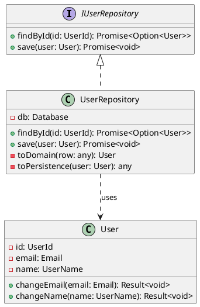

# C4 Model - Code Diagram

**Versão**: 1.0
**Data**: YYYY-MM-DD
**Nível**: 4 - Code (Optional)
**Component**: [Component Name]

---

## Overview

O diagrama de código mostra como um componente é implementado (classes, interfaces, etc).

⚠️ **Nota**: Este nível é opcional. Use apenas quando necessário para esclarecer implementação complexa.

---

## Class Diagram

```
┌─────────────────────────┐
│      <<interface>>      │
│   IUserRepository       │
├─────────────────────────┤
│ + findById(id): User    │
│ + save(user): void      │
└──────────▲──────────────┘
           │
           │ implements
           │
┌──────────┴──────────────┐
│  UserRepository         │
├─────────────────────────┤
│ - db: Database          │
├─────────────────────────┤
│ + findById(id): User    │
│ + save(user): void      │
│ - toDomain(row): User   │
└─────────────────────────┘
```

### PlantUML Notation


---

## Classes

### User (Entity)
```typescript
class User {
  private constructor(
    private readonly id: UserId,
    private email: Email,
    private name: UserName
  ) {}

  static create(props: CreateUserProps): Result<User> {
    // Factory method
  }

  changeEmail(email: Email): Result<void> {
    // Business logic
    this.addDomainEvent(new UserEmailChanged())
    return Result.ok()
  }
}
```

### UserRepository (Infrastructure)
```typescript
class UserRepository implements IUserRepository {
  constructor(private readonly db: Database) {}

  async findById(id: UserId): Promise<Option<User>> {
    const row = await this.db.query(...)
    return row ? Some(this.toDomain(row)) : None
  }

  async save(user: User): Promise<void> {
    const data = this.toPersistence(user)
    await this.db.query(...)
  }

  private toDomain(row: any): User {
    // Mapper
  }

  private toPersistence(user: User): any {
    // Mapper
  }
}
```

---

## Interfaces

### IUserRepository
```typescript
interface IUserRepository {
  findById(id: UserId): Promise<Option<User>>
  save(user: User): Promise<void>
  findByEmail(email: Email): Promise<Option<User>>
  delete(id: UserId): Promise<void>
}
```

---

## Value Objects

### Email
```typescript
class Email {
  private constructor(private readonly value: string) {}

  static create(value: string): Result<Email> {
    if (!this.isValid(value)) {
      return Result.fail('Invalid email')
    }
    return Result.ok(new Email(value))
  }

  private static isValid(value: string): boolean {
    return /^[^\s@]+@[^\s@]+\.[^\s@]+$/.test(value)
  }

  getValue(): string {
    return this.value
  }

  equals(other: Email): boolean {
    return this.value === other.value
  }
}
```

---

## References
- [Link to source code]
- [Link to API documentation]
