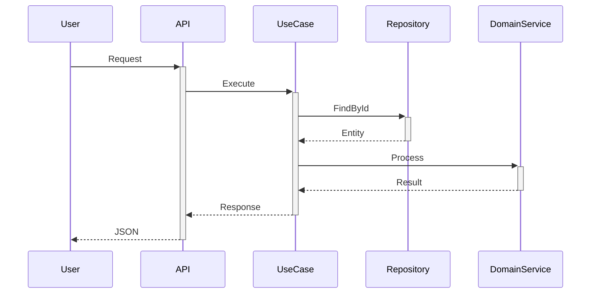

# Specs - [Nome da Feature]

**Status**: Draft | Review | Approved | Implemented
**Autor**: [Nome]
**Data**: YYYY-MM-DD
**Versão**: 1.0
**Relacionado**: `PRD.md`, `design.md`

---

## 1. Visão Geral

### 1.1 Objetivo
[O que esta especificação documenta]

### 1.2 Escopo
[O que está incluído e excluído desta especificação]

---

## 2. Casos de Uso

### UC-001: [Nome do Caso de Uso]
**Ator**: [Tipo de usuário]
**Pré-condições**:
- [ ] [Condição 1]
- [ ] [Condição 2]

**Fluxo Principal**:
1. [Passo 1]
2. [Passo 2]
3. [Passo 3]

**Fluxos Alternativos**:
- **3a**: Se [condição], então [ação]

**Pós-condições**:
- [ ] [Estado final 1]
- [ ] [Estado final 2]

**Regras de Negócio**:
- RN-001: [Descrição da regra]

---

## 3. Especificações Funcionais

### 3.1 Componente: [Nome]
**Localização**: `src/[context]/[container]/[component]/`

#### 3.1.1 Interface Pública
```typescript
interface [ComponentInterface] {
  /**
   * [Descrição do método]
   * @param [param] - [Descrição do parâmetro]
   * @returns [Descrição do retorno]
   * @throws [DomainError] - [Quando ocorre]
   */
  [method]([param]: [Type]): Promise<[ReturnType]>
}
```

#### 3.1.2 Comportamento
| Entrada | Processamento | Saída Esperada |
|---------|---------------|----------------|
| [Input] | [Lógica] | [Output] |

#### 3.1.3 Validações
```typescript
// Validação de entrada
const schema = z.object({
  [field]: z.string().min(3).max(50),
  [field2]: z.number().positive()
})
```

#### 3.1.4 Tratamento de Erros
| Erro | Código | Mensagem | HTTP Status |
|------|--------|----------|-------------|
| [InvalidInput] | ERR_001 | [Mensagem] | 400 |
| [NotFound] | ERR_404 | [Mensagem] | 404 |

---

### 3.2 Entidade: [Nome]
**Localização**: `src/[context]/domain/entities/`

#### 3.2.1 Definição
```typescript
class [Entity] {
  private constructor(
    private readonly id: [EntityId],
    private [property]: [ValueObject]
  ) {}

  static create([params]): Result<[Entity]> {
    // Factory method com validação
  }

  [method](): void {
    // Comportamento de domínio
    this.addDomainEvent(new [Event]())
  }
}
```

#### 3.2.2 Invariantes
- [ ] [Property] nunca pode ser null
- [ ] [Relationship] deve existir quando [condition]
- [ ] [Business rule] sempre deve ser verdadeira

#### 3.2.3 Eventos de Domínio
```typescript
class [DomainEvent] extends BaseDomainEvent {
  constructor(
    public readonly aggregateId: string,
    public readonly [payload]: [Type]
  ) {
    super()
  }
}
```

---

### 3.3 Value Object: [Nome]
**Localização**: `src/[context]/domain/value-objects/`

#### 3.3.1 Definição
```typescript
class [ValueObject] {
  private constructor(private readonly value: [Type]) {}

  static create(value: [Type]): Result<[ValueObject]> {
    if (!this.isValid(value)) {
      return Result.fail<[ValueObject]>('[Error message]')
    }
    return Result.ok<[ValueObject]>(new [ValueObject](value))
  }

  private static isValid(value: [Type]): boolean {
    // Regras de validação
  }

  equals(other: [ValueObject]): boolean {
    return this.value === other.value
  }
}
```

#### 3.3.2 Regras de Validação
| Regra | Validação | Mensagem de Erro |
|-------|-----------|------------------|
| [Nome] | [Lógica] | [Mensagem] |

---

## 4. APIs

### 4.1 Endpoint: [Method] /api/v1/[resource]

#### 4.1.1 Request
```http
[METHOD] /api/v1/[resource]
Content-Type: application/json
Authorization: Bearer {token}

{
  "[field]": "[value]",
  "[field2]": "[value2]"
}
```

#### 4.1.2 Response Success (2xx)
```json
{
  "id": "uuid",
  "[field]": "value",
  "createdAt": "2024-01-01T00:00:00Z"
}
```

#### 4.1.3 Response Error (4xx/5xx)
```json
{
  "error": {
    "code": "ERR_001",
    "message": "Description",
    "details": []
  }
}
```

#### 4.1.4 Validações
- [ ] [Field] é obrigatório
- [ ] [Field2] deve ser um email válido
- [ ] [Field3] deve estar entre X e Y

#### 4.1.5 Rate Limiting
- **Limite**: X requests por minuto
- **Header**: `X-RateLimit-Remaining`

---

## 5. Banco de Dados

### 5.1 Tabela: [table_name]

#### 5.1.1 Schema
```sql
CREATE TABLE [table_name] (
  id UUID PRIMARY KEY DEFAULT gen_random_uuid(),
  [column] [TYPE] NOT NULL,
  [column2] [TYPE] UNIQUE,
  [fk_id] UUID REFERENCES [other_table](id) ON DELETE CASCADE,
  created_at TIMESTAMPTZ NOT NULL DEFAULT NOW(),
  updated_at TIMESTAMPTZ NOT NULL DEFAULT NOW(),
  deleted_at TIMESTAMPTZ
);

-- Indexes
CREATE INDEX idx_[table]_[column] ON [table]([column]);
CREATE INDEX idx_[table]_[column2] ON [table]([column2]) WHERE deleted_at IS NULL;
```

#### 5.1.2 Constraints
| Constraint | Tipo | Descrição |
|------------|------|-----------|
| [name] | CHECK | [Condição] |
| [name] | UNIQUE | [Colunas] |

#### 5.1.3 Triggers
```sql
CREATE TRIGGER update_[table]_updated_at
BEFORE UPDATE ON [table]
FOR EACH ROW
EXECUTE FUNCTION update_updated_at_column();
```

---

## 6. Regras de Negócio

### RN-001: [Nome da Regra]
**Descrição**: [O que a regra especifica]

**Condições**:
- Se [condição 1]
- E [condição 2]

**Então**: [Ação/Resultado]

**Exceções**: [Quando a regra não se aplica]

**Implementação**:
```typescript
class [BusinessRule] implements IBusinessRule {
  isSatisfied(): boolean {
    // Lógica da regra
  }
}
```

---

## 7. Fluxos de Dados

### 7.1 Fluxo Principal


### 7.2 Transformações de Dados
| Camada | Formato | Transformação |
|--------|---------|---------------|
| API | DTO | → Mapper → |
| Application | Command | → Mapper → |
| Domain | Entity | ← Mapper ← |
| Infrastructure | ORM Model | |

---

## 8. Estados e Transições

### 8.1 Máquina de Estados
```
[Estado Inicial]
    ↓
[Estado Intermediário] → [Estado Alternativo]
    ↓
[Estado Final]
```

### 8.2 Regras de Transição
| De | Para | Condição | Ação |
|----|------|----------|------|
| [A] | [B] | [Condição] | [Ação] |

---

## 9. Integrações

### 9.1 Serviço Externo: [Nome]
**Endpoint**: `https://api.external.com/v1/[resource]`

#### 9.1.1 Autenticação
```
Authorization: Bearer {api_key}
```

#### 9.1.2 Request
```json
{
  "[field]": "[value]"
}
```

#### 9.1.3 Response
```json
{
  "[field]": "[value]"
}
```

#### 9.1.4 Error Handling
- **Timeout**: X segundos
- **Retry**: 3 tentativas com exponential backoff
- **Circuit Breaker**: Abrir após 5 falhas consecutivas

---

## 10. Performance

### 10.1 Requisitos
| Métrica | Target | Medição |
|---------|--------|---------|
| Response Time | < X ms | p95 |
| Throughput | > Y req/s | Média |
| Error Rate | < Z% | Total |

### 10.2 Otimizações
- [ ] Cache de [dados] com Redis (TTL: X min)
- [ ] Database connection pooling (min: X, max: Y)
- [ ] Query optimization com índices em [colunas]

---

## 11. Segurança

### 11.1 Autenticação
```typescript
@Authenticated()
@RateLimit({ max: 100, window: '1m' })
async [method]() { }
```

### 11.2 Autorização
```typescript
@RequirePermission('[permission]')
async [method]() { }
```

### 11.3 Validação de Input
- [ ] SQL Injection: Parameterized queries
- [ ] XSS: Output sanitization
- [ ] CSRF: Token validation

---

## 12. Testing

### 12.1 Unit Tests
```typescript
describe('[Component]', () => {
  it('should [behavior] when [condition]', () => {
    // Arrange
    const [input] = [value]

    // Act
    const result = [component].[method]([input])

    // Assert
    expect(result).toBe([expected])
  })
})
```

### 12.2 Integration Tests
```typescript
describe('[Feature] Integration', () => {
  it('should [end-to-end behavior]', async () => {
    // Setup
    await setupDatabase()

    // Execute
    const response = await request(app)
      .post('/api/v1/[resource]')
      .send([payload])

    // Verify
    expect(response.status).toBe(201)
    expect(response.body).toMatchObject([expected])
  })
})
```

### 12.3 Casos de Teste
| ID | Cenário | Input | Output Esperado |
|----|---------|-------|-----------------|
| TC-001 | [Cenário] | [Input] | [Output] |

---

## 13. Observabilidade

### 13.1 Logs
```typescript
logger.info('[Operation] completed', {
  duration: timer.end(),
  userId: context.userId,
  resourceId: resource.id
})
```

### 13.2 Métricas
```typescript
metrics.increment('feature.[operation].count')
metrics.histogram('feature.[operation].duration', duration)
```

### 13.3 Alertas
| Condição | Severidade | Ação |
|----------|------------|------|
| Error rate > X% | Critical | PagerDuty |
| Latency > Y ms | Warning | Slack |

---

## 14. Documentação de Código

### 14.1 JSDoc/TSDoc
```typescript
/**
 * [Descrição da função]
 *
 * @param [param] - [Descrição]
 * @returns [Descrição do retorno]
 * @throws {[ErrorType]} [Quando ocorre]
 *
 * @example
 * const result = await [function]([param])
 */
```

### 14.2 Comentários de Decisão
```typescript
// DECISION: Usando cache aqui porque [razão]
// Alternativas consideradas: [A, B, C]
// Trade-off: [Explicação]
```

---

## 15. Anexos

### 15.1 Diagramas
[Links ou imagens de diagramas técnicos]

### 15.2 Referências
- [Link para BDD feature file]
- [Link para ADR relacionada]
- [Link para documentação externa]

---

## Changelog

| Versão | Data | Autor | Mudanças |
|--------|------|-------|----------|
| 1.0 | YYYY-MM-DD | [Nome] | Versão inicial |
