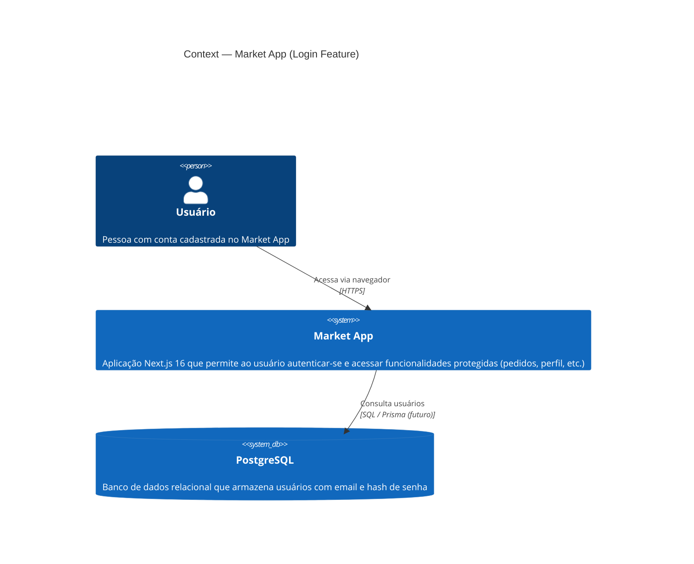
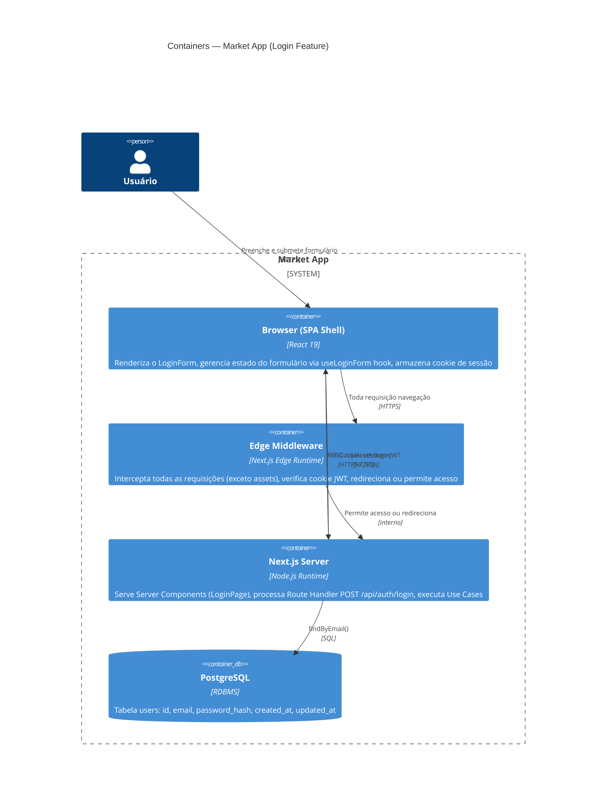
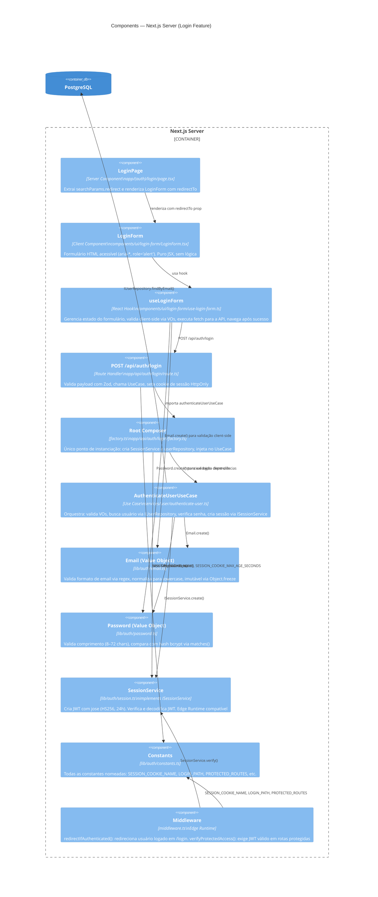
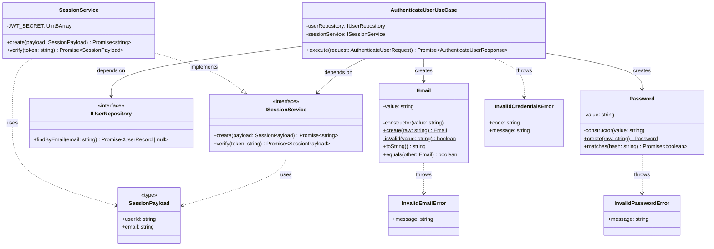
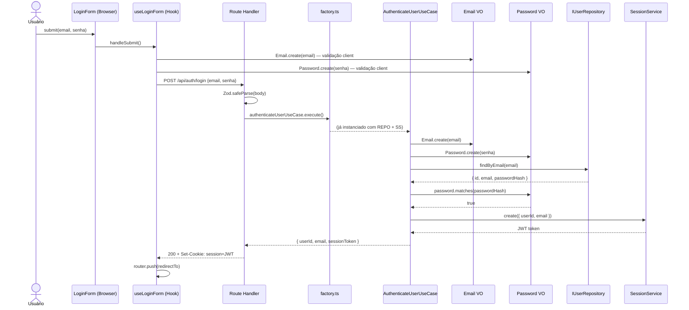
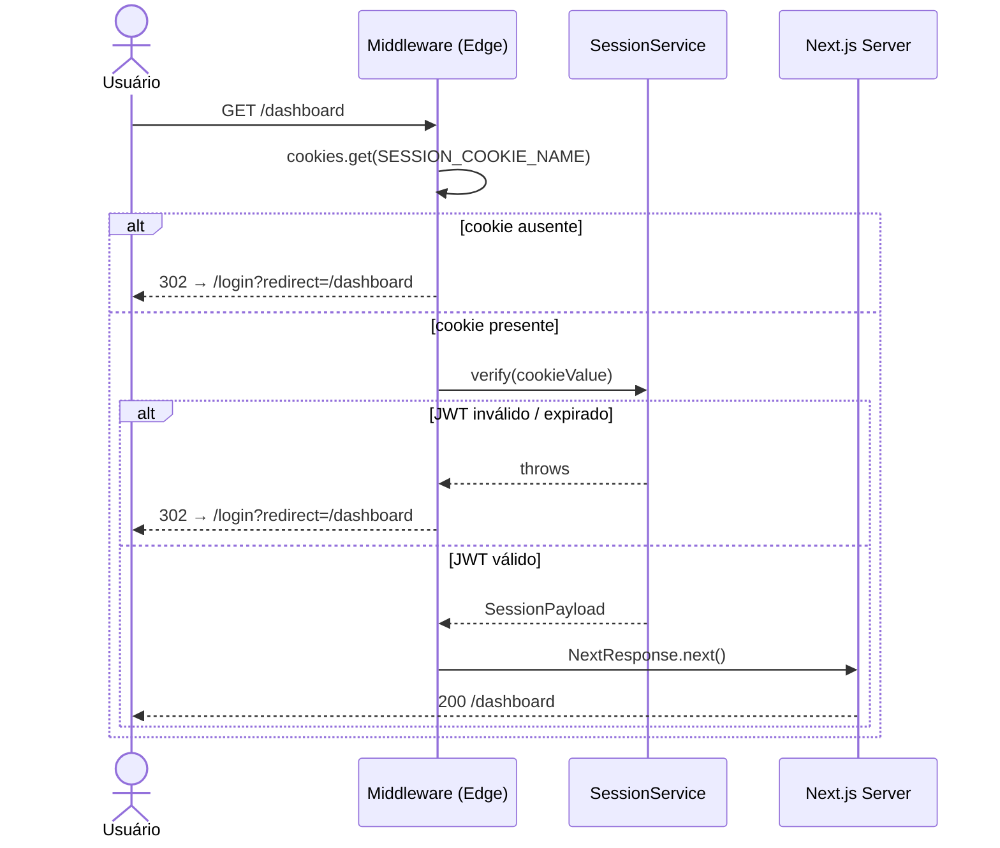

# C4 Model — Autenticação por Login (001-login)

**Versão**: 1.0
**Data**: 2026-02-28

---

## Nível 1 — Contexto do Sistema

*Quem usa o sistema e com quais sistemas externos ele interage.*

---

## Nível 2 — Containers

*Como o sistema é dividido em unidades deployáveis e como elas se comunicam.*

---

## Nível 3 — Componentes

*Como o container Next.js Server é decomposto em componentes.*

---

## Nível 4 — Código (Diagrama de Classes)

*Relações entre as principais abstrações do domínio de autenticação.*

---

## Fluxo de Dados — Login Bem-Sucedido

*Sequência detalhada atravessando todos os containers e componentes.*

---

## Fluxo de Dados — Proteção de Rota (Middleware)

