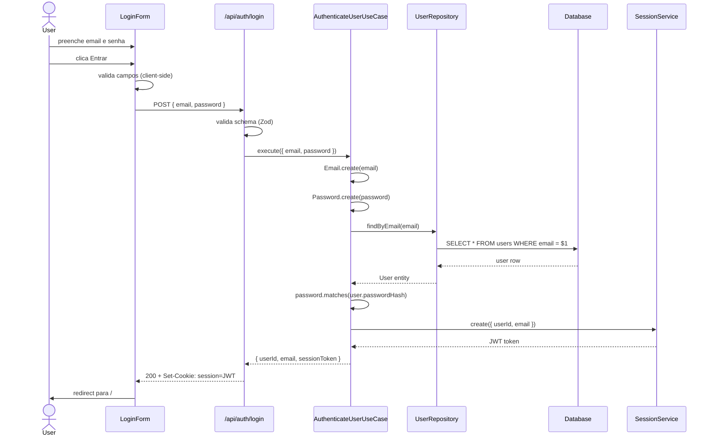

# Specs - Página de Login

**Status**: Draft
**Autor**: Fernando
**Data**: 2026-02-26
**Versão**: 1.0
**Relacionado**: `PRD.md`, `design.md`

---

## 1. Visão Geral

### 1.1 Objetivo
Esta especificação detalha os contratos técnicos, comportamentos esperados, validações e estruturas de dados para implementação da página de login com email e senha no Market App.

### 1.2 Escopo
**Incluído**: LoginPage, LoginForm, Email VO, Password VO, AuthenticateUserUseCase, API Route `/api/auth/login`, SessionService, AuthMiddleware, tabela `users`.

**Excluído**: Registro de usuário, recuperação de senha, login social, 2FA.

---

## 2. Casos de Uso

### UC-001: Autenticar Usuário com Email e Senha
**Ator**: Usuário cadastrado

**Pré-condições**:
- [ ] Usuário possui conta com email e senha cadastrados
- [ ] Usuário não está autenticado (sem cookie de sessão válido)
- [ ] A rota `/login` está acessível

**Fluxo Principal**:
1. Usuário acessa `/login` (diretamente ou via redirect de rota protegida)
2. Sistema exibe formulário com campos email e senha
3. Usuário preenche email e senha
4. Usuário clica em "Entrar"
5. Sistema valida campos no client-side (formato de email, tamanho da senha)
6. Sistema envia `POST /api/auth/login` com email e senha
7. API valida schema do payload
8. API busca usuário pelo email no banco
9. API compara senha com hash armazenado (bcrypt)
10. API gera JWT e seta cookie HttpOnly
11. Sistema redireciona usuário para rota de origem ou `/`

**Fluxos Alternativos**:
- **5a**: Se email inválido → exibe mensagem "Email inválido" abaixo do campo, não submete
- **5b**: Se senha < 8 chars → exibe mensagem "Senha deve ter no mínimo 8 caracteres", não submete
- **8a**: Se email não encontrado → retorna 401 com mensagem genérica
- **9a**: Se senha incorreta → retorna 401 com mensagem genérica (igual ao 8a, por segurança)
- **7a**: Se payload inválido (campos ausentes) → retorna 400
- **Rate limit**: Se IP excedeu 5 tentativas/min → retorna 429

**Pós-condições**:
- [ ] Cookie `session` (HttpOnly, Secure, SameSite=Strict) setado no browser
- [ ] Usuário redirecionado para rota de destino
- [ ] Próximas requisições incluem o cookie automaticamente

**Regras de Negócio**:
- RN-001: Mensagem de erro deve ser genérica ("Email ou senha inválidos") — não revelar se email existe
- RN-002: Email é normalizado para lowercase antes da busca
- RN-003: Máximo 5 tentativas de login por IP por minuto

---

### UC-002: Redirecionar Usuário Já Autenticado
**Ator**: Usuário com sessão ativa

**Fluxo Principal**:
1. Usuário acessa `/login` com cookie de sessão válido
2. Middleware detecta sessão ativa
3. Sistema redireciona para `/`

---

### UC-003: Proteger Rota Autenticada
**Ator**: Usuário não autenticado

**Fluxo Principal**:
1. Usuário acessa rota protegida (ex: `/dashboard`)
2. Middleware verifica ausência de cookie de sessão
3. Middleware redireciona para `/login?redirect=/dashboard`
4. Após login bem-sucedido, usuário é redirecionado para `/dashboard`

---

## 3. Especificações Funcionais

### 3.1 Componente: LoginForm
**Localização**: `components/ui/login-form/LoginForm.tsx`

#### 3.1.1 Interface Pública
```typescript
interface LoginFormProps {
  redirectTo?: string
}

export function LoginForm({ redirectTo = '/' }: LoginFormProps): JSX.Element
```

#### 3.1.2 Estado Interno
```typescript
type FormState = {
  email: string
  password: string
  errors: {
    email?: string
    password?: string
    general?: string
  }
  isLoading: boolean
}
```

#### 3.1.3 Comportamento
| Entrada | Processamento | Saída Esperada |
|---------|---------------|----------------|
| Email válido | Limpa erro de email | Campo sem mensagem de erro |
| Email inválido (sem @) | Define erro de email | "Email inválido" exibido |
| Senha < 8 chars | Define erro de senha | "Mínimo 8 caracteres" exibido |
| Submit com campos válidos | POST /api/auth/login | Loading → redirect ou erro |
| Resposta 401 | Define erro geral | "Email ou senha inválidos" |
| Resposta 429 | Define erro geral | "Muitas tentativas. Tente em 1 minuto." |
| Resposta 500 | Define erro geral | "Erro interno. Tente novamente." |

#### 3.1.4 Validações Client-Side
```typescript
const validateEmail = (value: string): string | undefined => {
  if (!value) return 'Email é obrigatório'
  if (!/^[^\s@]+@[^\s@]+\.[^\s@]+$/.test(value)) return 'Email inválido'
  return undefined
}

const validatePassword = (value: string): string | undefined => {
  if (!value) return 'Senha é obrigatória'
  if (value.length < 8) return 'Senha deve ter no mínimo 8 caracteres'
  return undefined
}
```

#### 3.1.5 Tratamento de Erros
| Erro | Código | Mensagem exibida | HTTP Status |
|------|--------|-----------------|-------------|
| Email inválido | INVALID_EMAIL | "Email inválido" | — (client only) |
| Senha muito curta | INVALID_PASSWORD | "Mínimo 8 caracteres" | — (client only) |
| Credenciais inválidas | INVALID_CREDENTIALS | "Email ou senha inválidos" | 401 |
| Rate limit | RATE_LIMITED | "Muitas tentativas. Tente em 1 minuto." | 429 |
| Erro do servidor | SERVER_ERROR | "Erro interno. Tente novamente." | 500 |

---

### 3.2 Value Object: Email
**Localização**: `types/auth.ts` ou `lib/auth/email.ts`

#### 3.2.1 Definição
```typescript
class Email {
  private readonly value: string

  private constructor(value: string) {
    this.value = value
    Object.freeze(this)
  }

  static create(raw: string): Email {
    const normalized = raw.toLowerCase().trim()
    if (!Email.isValid(normalized)) {
      throw new InvalidEmailError(normalized)
    }
    return new Email(normalized)
  }

  private static isValid(value: string): boolean {
    return /^[^\s@]+@[^\s@]+\.[^\s@]+$/.test(value)
  }

  toString(): string {
    return this.value
  }

  equals(other: Email): boolean {
    return this.value === other.value
  }
}
```

#### 3.2.2 Regras de Validação
| Regra | Validação | Mensagem de Erro |
|-------|-----------|------------------|
| Não vazio | `value.length > 0` | "Email é obrigatório" |
| Formato válido | regex RFC 5322 básico | "Formato de email inválido" |
| Sem espaços | trim antes de validar | normalizado silenciosamente |

#### 3.2.3 Invariantes
- [ ] `value` nunca é nulo, vazio ou com espaços
- [ ] `value` sempre em lowercase
- [ ] Objeto é imutável após criação (`Object.freeze`)

---

### 3.3 Value Object: Password
**Localização**: `lib/auth/password.ts`

#### 3.3.1 Definição
```typescript
class Password {
  private readonly value: string

  private constructor(value: string) {
    this.value = value
    Object.freeze(this)
  }

  static create(raw: string): Password {
    if (raw.length < 8) {
      throw new InvalidPasswordError('Senha deve ter no mínimo 8 caracteres')
    }
    if (raw.length > 72) {
      throw new InvalidPasswordError('Senha deve ter no máximo 72 caracteres')
    }
    return new Password(raw)
  }

  matches(hash: string): Promise<boolean> {
    return bcrypt.compare(this.value, hash)
  }
}
```

#### 3.3.2 Regras de Validação
| Regra | Validação | Mensagem de Erro |
|-------|-----------|------------------|
| Tamanho mínimo | `length >= 8` | "Mínimo 8 caracteres" |
| Tamanho máximo | `length <= 72` | "Máximo 72 caracteres" (limite bcrypt) |
| Não vazio | `length > 0` | "Senha é obrigatória" |

---

### 3.4 Use Case: AuthenticateUserUseCase
**Localização**: `services/user/authenticate-user.ts`

#### 3.4.1 Interface
```typescript
interface AuthenticateUserRequest {
  email: string
  password: string
}

interface AuthenticateUserResponse {
  userId: string
  email: string
  sessionToken: string
}

interface IUserRepository {
  findByEmail(email: Email): Promise<User | null>
}

class AuthenticateUserUseCase {
  constructor(private readonly userRepository: IUserRepository) {}

  async execute(request: AuthenticateUserRequest): Promise<AuthenticateUserResponse>
}
```

#### 3.4.2 Fluxo de Execução
```typescript
async execute(request: AuthenticateUserRequest): Promise<AuthenticateUserResponse> {
  const email = Email.create(request.email)
  const password = Password.create(request.password)

  const user = await this.userRepository.findByEmail(email)
  if (!user) {
    throw new InvalidCredentialsError()
  }

  const passwordMatches = await password.matches(user.passwordHash)
  if (!passwordMatches) {
    throw new InvalidCredentialsError()
  }

  const sessionToken = await SessionService.create({ userId: user.id, email: email.toString() })

  return { userId: user.id, email: email.toString(), sessionToken }
}
```

#### 3.4.3 Regras de Negócio
- RN-001: `InvalidCredentialsError` lançado tanto para email não encontrado quanto para senha incorreta (mesma exceção — não revelar qual campo está errado)
- RN-002: Password.create() valida formato antes de qualquer I/O
- RN-003: Email normalizado (lowercase) antes da busca

---

### 3.5 Serviço: SessionService
**Localização**: `lib/auth/session.ts`

#### 3.5.1 Interface
```typescript
interface SessionPayload {
  userId: string
  email: string
}

class SessionService {
  static async create(payload: SessionPayload): Promise<string>
  static async verify(token: string): Promise<SessionPayload>
}
```

#### 3.5.2 Comportamento
| Método | Entrada | Processamento | Saída |
|--------|---------|---------------|-------|
| `create` | `SessionPayload` | Assina JWT com `JWT_SECRET`, exp 24h | JWT string |
| `verify` | JWT string | Verifica assinatura e expiração | `SessionPayload` ou throw |

---

## 4. APIs

### 4.1 Endpoint: POST /api/auth/login

#### 4.1.1 Request
```http
POST /api/auth/login
Content-Type: application/json

{
  "email": "usuario@exemplo.com",
  "password": "minhasenha123"
}
```

#### 4.1.2 Response — Sucesso (200)
```json
{
  "user": {
    "id": "550e8400-e29b-41d4-a716-446655440000",
    "email": "usuario@exemplo.com"
  }
}
```
**Headers**:
```
Set-Cookie: session=<JWT>; HttpOnly; Secure; SameSite=Strict; Path=/; Max-Age=86400
```

#### 4.1.3 Response — Erro de Validação (400)
```json
{
  "error": {
    "code": "VALIDATION_ERROR",
    "message": "Payload inválido",
    "details": [{ "field": "email", "message": "Email é obrigatório" }]
  }
}
```

#### 4.1.4 Response — Credenciais Inválidas (401)
```json
{
  "error": {
    "code": "INVALID_CREDENTIALS",
    "message": "Email ou senha inválidos"
  }
}
```

#### 4.1.5 Response — Rate Limit (429)
```json
{
  "error": {
    "code": "RATE_LIMITED",
    "message": "Muitas tentativas. Tente novamente em 1 minuto."
  }
}
```

#### 4.1.6 Validações do Schema (Zod)
```typescript
const LoginSchema = z.object({
  email: z.string().min(1, 'Email é obrigatório').email('Email inválido'),
  password: z.string().min(8, 'Senha deve ter no mínimo 8 caracteres'),
})
```

#### 4.1.7 Rate Limiting
- **Limite**: 5 requests por IP por minuto
- **Implementação**: verificação via `x-forwarded-for` ou `x-real-ip`
- **Header de resposta**: `Retry-After: 60`

---

## 5. Banco de Dados

### 5.1 Tabela: users

#### 5.1.1 Schema
```sql
CREATE TABLE users (
  id UUID PRIMARY KEY DEFAULT gen_random_uuid(),
  email VARCHAR(255) NOT NULL,
  password_hash VARCHAR(255) NOT NULL,
  created_at TIMESTAMPTZ NOT NULL DEFAULT NOW(),
  updated_at TIMESTAMPTZ NOT NULL DEFAULT NOW()
);

CREATE UNIQUE INDEX idx_users_email ON users(email);

CREATE TRIGGER update_users_updated_at
BEFORE UPDATE ON users
FOR EACH ROW
EXECUTE FUNCTION update_updated_at_column();
```

#### 5.1.2 Constraints
| Constraint | Tipo | Descrição |
|------------|------|-----------|
| `users_email_unique` | UNIQUE | Email deve ser único no sistema |
| `users_email_not_null` | NOT NULL | Email obrigatório |
| `users_password_hash_not_null` | NOT NULL | Hash obrigatório |

---

## 6. Regras de Negócio

### RN-001: Mensagem de Erro Genérica em Falha de Autenticação
**Descrição**: O sistema não deve revelar se o email existe ou não no banco de dados.

**Condições**:
- Se email não encontrado
- Ou se senha incorreta

**Então**: Retornar a mesma mensagem genérica "Email ou senha inválidos" com status 401.

**Implementação**:
```typescript
// Ambos os casos lançam a mesma exceção
throw new InvalidCredentialsError('Email ou senha inválidos')
```

---

### RN-002: Normalização de Email
**Descrição**: Email é normalizado para lowercase e sem espaços antes de qualquer operação.

**Condições**:
- Sempre que um email for recebido como input

**Então**: Aplicar `.toLowerCase().trim()` antes de validar e buscar.

---

### RN-003: Rate Limiting por IP
**Descrição**: Máximo de 5 tentativas de login por IP por janela de 1 minuto.

**Condições**:
- Qualquer requisição para `POST /api/auth/login`

**Então**: Se IP excedeu limite, retornar 429 sem executar lógica de autenticação.

---

## 7. Fluxos de Dados

### 7.1 Fluxo de Login Bem-Sucedido


### 7.2 Transformações de Dados
| Camada | Formato | Transformação |
|--------|---------|---------------|
| HTTP | JSON body `{ email, password }` | → Zod parse → |
| API Route | `LoginRequest` DTO | → use case execute → |
| Use Case | `Email` VO, `Password` VO | → repository query → |
| Repository | DB row `{ id, email, password_hash }` | → domain mapper → |
| Domain | `User` entity | ← use case result |

---

## 8. Estados e Transições

### 8.1 Máquina de Estados do LoginForm
```
[idle]
  ↓ (usuário digita)
[editing] → (campo inválido) → [editing com erros]
  ↓ (campos válidos, submit)
[loading]
  ↓ (200)          ↓ (4xx/5xx)
[redirect]        [idle com erro geral]
```

### 8.2 Regras de Transição
| De | Para | Condição | Ação |
|----|------|----------|------|
| `idle` | `editing` | Usuário digita qualquer campo | Atualizar estado do campo |
| `editing` | `loading` | Submit com campos válidos | Chamar POST /api/auth/login |
| `loading` | `redirect` | Resposta 200 | Redirecionar para `redirectTo` |
| `loading` | `idle com erro` | Resposta 4xx/5xx | Exibir mensagem de erro geral |

---

## 9. Integrações

### 9.1 Banco de Dados (PostgreSQL via Prisma)
**Operação**: `SELECT id, email, password_hash FROM users WHERE email = $1`

#### 9.1.1 Autenticação
Via `DATABASE_URL` (env var) — string de conexão completa.

#### 9.1.2 Error Handling
- **Timeout**: 5 segundos
- **Conexão falha**: throw `DatabaseUnavailableError` → API retorna 500

---

## 10. Performance

### 10.1 Requisitos
| Métrica | Target | Medição |
|---------|--------|---------|
| API response time | < 300ms | p95 |
| bcrypt.compare | ~100ms | Esperado (cost 12) |
| DB query | < 10ms | p95 com índice |
| Page LCP | < 1s | Lighthouse |

### 10.2 Otimizações
- [ ] Índice único em `users.email` (busca O(log n))
- [ ] Server Component para LoginPage (zero JS no shell)
- [ ] Client Component apenas para LoginForm (hydration mínima)

---

## 11. Segurança

### 11.1 Autenticação
```typescript
// SessionService — criar JWT
const token = await new SignJWT({ userId, email })
  .setProtectedHeader({ alg: 'HS256' })
  .setExpirationTime('24h')
  .setIssuedAt()
  .sign(new TextEncoder().encode(process.env.JWT_SECRET))
```

### 11.2 Configuração do Cookie
```typescript
response.cookies.set('session', token, {
  httpOnly: true,
  secure: process.env.NODE_ENV === 'production',
  sameSite: 'strict',
  path: '/',
  maxAge: 60 * 60 * 24, // 24 horas
})
```

### 11.3 Validação de Input
- [ ] SQL Injection: prevenido pelo Prisma (queries parametrizadas)
- [ ] XSS: output sanitizado pelo React (JSX escaping automático)
- [ ] CSRF: mitigado por SameSite=Strict

---

## 12. Testing

### 12.1 Unit Tests — Email VO
```typescript
describe('Email', () => {
  describe('create', () => {
    it('should create valid email', () => {
      const email = Email.create('user@example.com')
      expect(email.toString()).toBe('user@example.com')
    })

    it('should normalize to lowercase', () => {
      const email = Email.create('USER@EXAMPLE.COM')
      expect(email.toString()).toBe('user@example.com')
    })

    it('should throw for email without @', () => {
      expect(() => Email.create('invalidemail')).toThrow(InvalidEmailError)
    })

    it('should throw for empty string', () => {
      expect(() => Email.create('')).toThrow(InvalidEmailError)
    })
  })
})
```

### 12.2 Unit Tests — Password VO
```typescript
describe('Password', () => {
  describe('create', () => {
    it('should create valid password with 8+ chars', () => {
      expect(() => Password.create('senha123')).not.toThrow()
    })

    it('should throw for password with 7 chars', () => {
      expect(() => Password.create('abc1234')).toThrow(InvalidPasswordError)
    })

    it('should throw for empty password', () => {
      expect(() => Password.create('')).toThrow(InvalidPasswordError)
    })

    it('should throw for password over 72 chars', () => {
      expect(() => Password.create('a'.repeat(73))).toThrow(InvalidPasswordError)
    })
  })
})
```

### 12.3 Unit Tests — AuthenticateUserUseCase
```typescript
describe('AuthenticateUserUseCase', () => {
  it('should return session token for valid credentials', async () => {
    const mockRepo = { findByEmail: jest.fn().mockResolvedValue(mockUser) }
    const useCase = new AuthenticateUserUseCase(mockRepo)

    const result = await useCase.execute({ email: 'user@test.com', password: 'senha123' })

    expect(result.sessionToken).toBeDefined()
  })

  it('should throw InvalidCredentialsError for unknown email', async () => {
    const mockRepo = { findByEmail: jest.fn().mockResolvedValue(null) }
    const useCase = new AuthenticateUserUseCase(mockRepo)

    await expect(useCase.execute({ email: 'unknown@test.com', password: 'senha123' }))
      .rejects.toThrow(InvalidCredentialsError)
  })

  it('should throw InvalidCredentialsError for wrong password', async () => {
    const mockRepo = { findByEmail: jest.fn().mockResolvedValue(mockUser) }
    const useCase = new AuthenticateUserUseCase(mockRepo)

    await expect(useCase.execute({ email: 'user@test.com', password: 'wrongpassword' }))
      .rejects.toThrow(InvalidCredentialsError)
  })
})
```

### 12.4 Casos de Teste
| ID | Cenário | Input | Output Esperado |
|----|---------|-------|-----------------|
| TC-001 | Login com credenciais válidas | email/senha corretos | 200 + cookie setado |
| TC-002 | Email não cadastrado | email inexistente | 401 INVALID_CREDENTIALS |
| TC-003 | Senha incorreta | email correto + senha errada | 401 INVALID_CREDENTIALS |
| TC-004 | Email malformado | "naoeumemail" | 400 VALIDATION_ERROR |
| TC-005 | Senha muito curta | senha < 8 chars | 400 VALIDATION_ERROR |
| TC-006 | Campos ausentes | `{}` | 400 VALIDATION_ERROR |
| TC-007 | Rate limit excedido | 6ª tentativa em 1 min | 429 RATE_LIMITED |
| TC-008 | Usuário já autenticado acessa /login | cookie válido | redirect para / |

---

## 13. Observabilidade

### 13.1 Logs
```typescript
// Sucesso
logger.info('auth.login.success', { userId, duration })

// Falha por credenciais
logger.warn('auth.login.invalid_credentials', { email: email.substring(0, 3) + '***' })

// Rate limit
logger.warn('auth.login.rate_limited', { ip })

// Erro interno
logger.error('auth.login.error', { message: error.message })
```

### 13.2 Métricas
```typescript
metrics.increment('auth.login.attempt')
metrics.increment('auth.login.success')
metrics.increment('auth.login.failure', { reason: 'invalid_credentials' })
metrics.histogram('auth.login.duration', durationMs)
```

### 13.3 Alertas
| Condição | Severidade | Ação |
|----------|------------|------|
| Error rate > 10% | Warning | Slack |
| Error rate > 50% | Critical | PagerDuty |
| Latency p95 > 1s | Warning | Slack |

---

## 14. Documentação de Código

### 14.1 TSDoc para SessionService
```typescript
/**
 * Cria um JWT de sessão para o usuário autenticado.
 *
 * @param payload - Dados do usuário para incluir no token
 * @returns JWT assinado com expiração de 24 horas
 * @throws {Error} Se JWT_SECRET não está configurado
 */
static async create(payload: SessionPayload): Promise<string>
```

---

## 15. Anexos

### 15.1 Referências
- [PRD - Página de Login](./PRD.md)
- [Design - Página de Login](./design.md)
- [OWASP Authentication Cheat Sheet](https://cheatsheetseries.owasp.org/cheatsheets/Authentication_Cheat_Sheet.html)

---

## Changelog

| Versão | Data | Autor | Mudanças |
|--------|------|-------|----------|
| 1.0 | 2026-02-26 | Fernando | Versão inicial |
